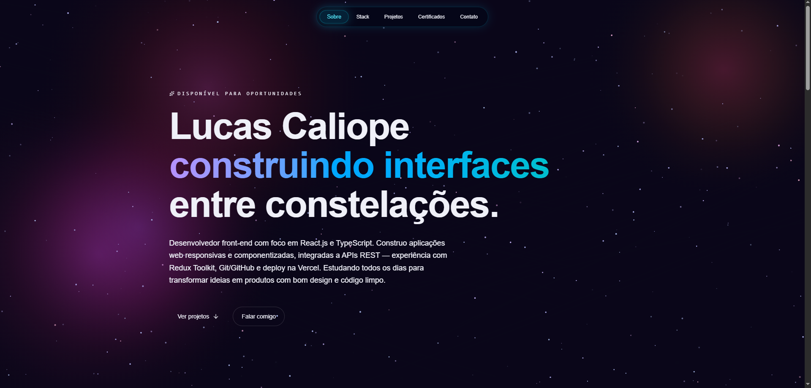
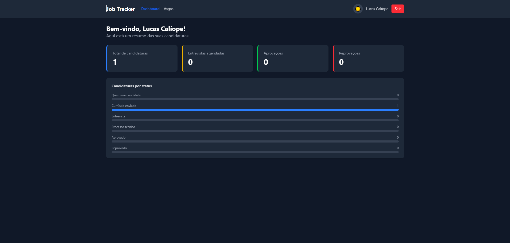
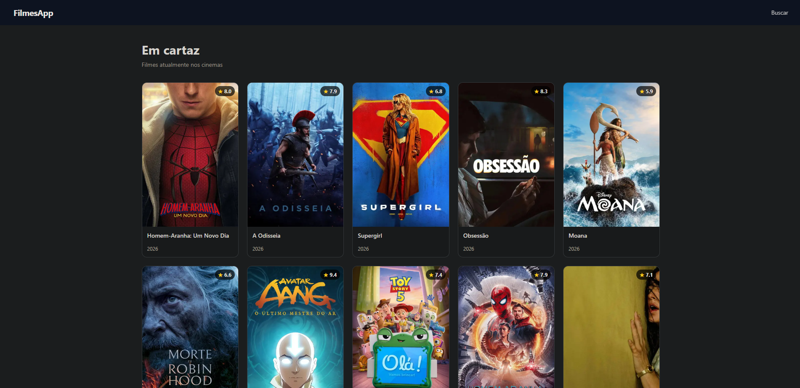

#  Lucas (Luscaliope) Calíope

  

Desenvolvedor Front-End em transição de carreira com foco em <b>React, Next.js e TypeScript</b>.  
Experiência prática em desenvolvimento de interfaces modernas, responsivas e consumo de APIs REST.

Atualmente estudando <b>Desenvolvimento Front-End pela EBAC</b>, desenvolvendo projetos com <b>React, React Native, Redux, Tailwind CSS e Next.js</b>.  
Interesse em arquitetura Front-End, performance, componentização e experiência do usuário.

---

# 📌 Objetivo Profissional

🎯 Desenvolvedor Front-End em transição de carreira, focado em construir aplicações modernas, responsivas e com boas práticas de desenvolvimento.

Atualmente estudo Desenvolvimento Front-End na EBAC e desenvolvo projetos utilizando tecnologias como React, Next.js, TypeScript, React Native e Vue.js.

---

# 🌐 Conecte-se comigo

---

### Frontend

### Mobile

### Ferramentas & Versionamento

---

# 🚀 Projetos Principais

---

## ⭐ Blog Dev

Blog técnico desenvolvido com **Next.js 15**, utilizando App Router, MDX e Tailwind CSS v4.

### Principais funcionalidades

- ✅ Next.js 15
- ✅ App Router
- ✅ SEO
- ✅ MDX
- ✅ Performance
- ✅ Design Responsivo

🔗 **Repositório:** https://github.com/Finagoth/blog-dev

🚀 **Demo:** https://blog-dev-lucas.vercel.app/

---

## 💼 Job Tracker

Sistema para gerenciamento de candidaturas de emprego.

### Principais funcionalidades

- ✅ Dashboard
- ✅ CRUD de vagas
- ✅ Autenticação
- ✅ Dark Mode
- ✅ Métricas
- ✅ Filtros

🔗 **Repositório:** https://github.com/Finagoth/job-tracker

🚀 **Demo:** https://job-tracker-rho-roan.vercel.app/

---

## 🎬 Filmes App

Aplicação web para consulta de filmes consumindo a API do TMDB.

### Principais funcionalidades

- ✅ Consumo de API
- ✅ Busca dinâmica
- ✅ React Router
- ✅ Hooks
- ✅ Interface Responsiva

🔗 **Repositório:** https://github.com/Finagoth/filmes-app

🚀 **Demo:** https://filmes-app-six.vercel.app/

# 📂 Outros Projetos

| Projeto | Tecnologias | Demo |
|---------|-------------|:---:|
| 💰 **Finanças App** | React Native • Expo | [✅](https://expo.dev/accounts/finagoth/projects/financas-app) |
| 🍔 **E-Food** | React • Redux Toolkit | [✅](https://efood-projeto6-coral.vercel.app/) |
| 🛒 **Lista Mercado** | JavaScript • HTML • CSS | [✅](https://lista-mercado-rho.vercel.app/) |
| ✅ **Todo Vue** | Vue.js | [✅](https://todolist-vuejs-chi.vercel.app/) |
| 🧮 **Calculadora IMC** | React | [✅](https://calculadora-imc-red-nu.vercel.app/) |

---

# 📊 Estatísticas GitHub

---

# 🧠 Áreas de Interesse

### Frontend
• Desenvolvimento de interfaces modernas e responsivas com React e Next.js  
• Aplicações web escaláveis utilizando TypeScript  
• Consumo e integração de APIs REST  
• Componentização e arquitetura Front-End  
• Performance, responsividade e experiência do usuário (UI/UX)  
• Gerenciamento de estado com Context API e Redux Toolkit  

### Mobile
• Desenvolvimento mobile com React Native e Expo  
• Criação de interfaces mobile responsivas  
• Persistência local de dados e navegação entre telas  

### Atualmente estudando
• Next.js App Router  
• Tailwind CSS v4  
• Boas práticas de arquitetura Front-End  
• Otimização e organização de projetos React  

---

⭐ Sempre buscando evoluir como desenvolvedor e construir projetos cada vez mais completos.
